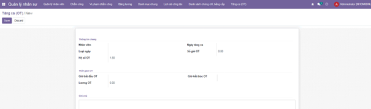

<h2 align="center">
    <a href="https://dainam.edu.vn/vi/khoa-cong-nghe-thong-tin">
    🎓 Faculty of Information Technology (DaiNam University)
    </a>
</h2>
<h2 align="center">
   PLATFORM ERP
</h2>
<div align="center">
    <p align="center">
        
        
        

 </p>

[](https://www.facebook.com/DNUAIoTLab)
[](https://dainam.edu.vn/vi/khoa-cong-nghe-thong-tin)
[](https://dainam.edu.vn)

</div>
 
## 📖 1. Giới thiệu
Trong quá trình vận hành, doanh nghiệp thường gặp khó khăn trong việc quản lý tài sản và phòng họp do dữ liệu phân tán, đặt lịch thủ công và thiếu công cụ theo dõi tập trung. Điều này dẫn đến trùng lịch, thất thoát tài sản và giảm hiệu quả sử dụng nguồn lực.
Dự án Module Quản lý Tài sản & Quản lý Phòng họp được xây dựng nhằm số hóa và tự động hóa các quy trình quản lý, giúp doanh nghiệp sử dụng tài nguyên hiệu quả và minh bạch hơn.

**Các tính năng chính:**

*Quản lý nhân sự: hồ sơ,cơ cấu tổ chức, tính lương*

*Quản lý tài sản: danh sách tài sản, gán tài sản, theo dõi tình trạng và bảo trì*

*Quản lý phòng họp: quản lý phòng, đặt phòng, kiểm soát trùng lịch, gắn tài sản cho phòng*

**Ứng dụng công nghệ mới**

*AI/LLM: trợ lý ảo hướng dẫn quy trình, tóm tắt nội dung họp, OCR hóa đơn/chứng từ*

*External API: đồng bộ Google Calendar, gửi thông báo qua Zalo/Telegram/Email*


## 🔧 2. Các công nghệ được sử dụng
<div align="center">

### Hệ điều hành
[](https://ubuntu.com/)
### Công nghệ chính
[](https://www.odoo.com/)
[](https://www.python.org/)
[](https://developer.mozilla.org/en-US/docs/Web/JavaScript)
[](https://www.w3.org/XML/)
### Cơ sở dữ liệu
[](https://www.postgresql.org/)
</div>


---


# 1. Tổng quan hệ thống (System Overview)

Hệ thống ERP quản lý doanh nghiệp (Enterprise Resource Planning) được xây dựng nhằm mục đích tối ưu hóa quy trình quản lý nội bộ, tập trung vào ba mảng cốt lõi: **Quản lý Nhân sự**, **Quản lý Tài sản** và **Quản lý Phòng họp**.

Dự án cung cấp giải pháp toàn diện giúp doanh nghiệp theo dõi tài sản, điều phối nhân sự và quản lý cơ sở vật chất một cách khoa học, hiệu quả và minh bạch.

---

# 2. Các phân hệ chính (Core Modules)

## 2.1. Module Quản lý Nhân sự (`nhansu`)
Module cung cấp công cụ quản lý toàn diện vòng đời của nhân viên trong doanh nghiệp, từ thông tin cơ bản đến chi tiết công/lương.

### Quản lý cơ cấu tổ chức
|  ||
|:---:|:---:|
|  |  |
| *Quản lý Phòng ban* | *Quản lý Chức vụ* |


|  ||
|:---:|:---:|
|  |  |
| *Quản lý Nhân viên* | *Chứng chỉ & Bằng cấp* |


 |  ||
|:---:|:---:|
|   |  |
| *Danh sách chứng chỉ, bằng cấp* | *Lịch sử công tác* |


### Quản lý chấm công & tiền lương
*   **Chấm công
*   **Vi phạm chấm công 
    

*   **Tăng ca
 


  
*   **Kỳ lương

  
*   **Bảng lương tháng

  


## 2.2. Module Quản lý Tài sản (`quan_ly_tai_san`)
Module tập trung vào việc giám sát, định giá và tối ưu hóa hiệu suất sử dụng tài sản của doanh nghiệp.


### Dashboard & Báo cáo
*   **Dashboard Tổng quan
  
*   **Dashboard Mượn trả
  

### Quản lý danh mục & Tài sản
*   **Loại tài sản (`danh_muc_tai_san`):** Phân loại tài sản (ví dụ: Thiết bị điện tử, Nội thất, Phương tiện đi lại).
*   **Quản lý tài sản cụ thể (`tai_san`):** Theo dõi thông tin chi tiết từng tài sản:
    *   Thông tin cơ bản: mã, tên, ngày mua, giá trị ban đầu, giá trị hiện tại
    *   Thông tin kỹ thuật: nhà sản xuất, model, serial number
    *   Vị trí & Trách nhiệm: địa điểm (`location`), người chịu trách nhiệm, phòng ban quản lý
    *   Trạng thái: mới, đang sử dụng, bảo trì, hư hỏng, mất, thanh lý, đã bán, đã hủy
    *   Khấu hao: phương pháp khấu hao (tuyến tính, giảm dần, không), thời gian sử dụng
    *   Tài sản dùng chung: đánh dấu tài sản có thể dùng chung (cho phòng họp)

### Vận hành & Khai thác
*   **Phân bổ tài sản (`phan_bo_tai_san`):** Cấp phát tài sản cho nhân viên hoặc phòng ban cụ thể, theo dõi lịch sử phân bổ.
*   **Đơn mượn tài sản (`don_muon_tai_san`):** Quy trình đăng ký mượn với workflow: Nháp -> Chờ duyệt -> Đã duyệt / Từ chối.
*   **Quản lý mượn trả (`muon_tra_tai_san`):** Quản lý chi tiết quá trình mượn và hoàn trả tài sản, theo dõi thời hạn trả.
*   **Phiếu sử dụng (`phieu_su_dung`):** Ghi nhận việc sử dụng tài sản, tự động cập nhật phân bổ.
*   **Luân chuyển tài sản (`luan_chuyen_tai_san`):** Điều chuyển tài sản giữa các bộ phận/chi nhánh.

### Tài chính & Kế toán
*   **Khấu hao tài sản (`lich_su_khau_hao`):** Tính toán và lưu lịch sử khấu hao tài sản theo thời gian (tuyến tính, giảm dần).
*   **Kiểm kê tài sản (`kiem_ke_tai_san`):** So khớp số lượng thực tế và sổ sách, phát hiện thiếu/thừa.
*   **Thanh lý tài sản (`thanh_ly_tai_san`):** Quy trình thanh lý tài sản hết hạn mức sử dụng hoặc hư hỏng.

### Bảo trì & Mua sắm
*   **Bảo trì tài sản (`bao_tri_tai_san`):** Quản lý lịch sử sửa chữa, bảo dưỡng định kỳ:
    *   Loại bảo trì: bảo trì định kỳ, sửa chữa, bảo hành, nâng cấp
    *   Chi phí: nhân công, vật tư, thuê ngoài
    *   Nhà cung cấp/sửa chữa
    *   Thời gian dừng máy
*   **Phiếu mua sắm (`mua_sam_tai_san`):** Đề xuất và theo dõi mua mới tài sản, tự động tạo tài sản khi nhận hàng.
*   **Đặt phòng (`dat_phong`):** Đặt phòng liên quan đến tài sản (tích hợp với `quan_ly_phong_hop`).

### Cấu hình
*   **Địa điểm (`tai_san.location`):** Cấu hình địa điểm phân cấp (site/building/floor/room) để quản lý vị trí tài sản.
*   **Nhà cung cấp:** Quản lý thông tin nhà cung cấp (tích hợp với `res.partner`).

### Tích hợp
*   Tích hợp với module `nhansu`: Sử dụng thông tin nhân viên, phòng ban, chức vụ.
*   Tích hợp với module `quan_ly_phong_hop`: Cung cấp tài sản cho phòng họp, quản lý tài sản trong phòng.

## 2.3. Module Quản lý Phòng họp (`quan_ly_phong_hop`)
Giải pháp tối ưu hóa việc sử dụng không gian chung, tích hợp chặt chẽ với quản lý tài sản và nhân sự.

**Các tính năng chính:**

### Dashboard nâng cao
*   **Dashboard Tổng quan:** Trung tâm điều hành phòng họp với các KPI chiến lược:
    *   Tổng số phòng, cuộc họp hôm nay/tuần, tổng giờ sử dụng
    *   Tỷ lệ sử dụng phòng, tỷ lệ lãng phí, tỷ lệ hủy, tỷ lệ no-show
    *   Heatmap sử dụng phòng (Giờ x Phòng)
    *   Hiệu suất theo phòng ban/người dùng
    *   Phân tích chất lượng cuộc họp
    *   Tình trạng tài sản & phòng (Asset Health)
    *   Hoạt động gần đây (Activity Feed)
    *   Bộ lọc nâng cao: theo địa điểm, phòng ban, khoảng thời gian

### Quản lý danh sách phòng họp
*   **Phòng họp (`phong_hop`):** Quản lý thông tin chi tiết phòng:
    *   Thông tin cơ bản: mã phòng, tên phòng, sức chứa, loại phòng (nhỏ/vừa/lớn/training/board/conference)
    *   Địa điểm: tích hợp với `tai_san.location` (site/building/floor/room)
    *   Tiện ích: máy chiếu, TV, VC device, bảng trắng, micro, camera, WiFi, điều hòa
    *   Khung giờ hoạt động: giờ bắt đầu/kết thúc hoặc hoạt động cả ngày
    *   Quy định đặt phòng: thời lượng tối thiểu/tối đa, lead time, buffer time
    *   Trạng thái: sẵn sàng, bảo trì, ngừng hoạt động
    *   Thống kê: tỷ lệ sử dụng, số lượng booking, số lượng no-show
*   **Phòng đã đặt:** Danh sách các phòng đã có booking, filter để xem nhanh.

### Đặt phòng & Điều phối
*   **Lịch đặt phòng (`dat_phong_hop`):** Quản lý đặt phòng với workflow đầy đủ:
    *   Workflow: Nháp -> Chờ duyệt -> Đã duyệt / Từ chối -> Đã xác nhận -> Đã check-in -> Đang diễn ra -> Hoàn thành / No-show / Đã hủy
    *   Thông tin đặt phòng: tiêu đề, thời gian bắt đầu/kết thúc, người chủ trì, mục đích
    *   Tích hợp HR: Chọn tham dự theo chức vụ (`chuc_vu`) và phòng ban (`phong_ban`)
    *   Người tham dự: danh sách nhân viên tham dự
    *   Tự động phát hiện xung đột lịch họp
    *   Calendar view: xem theo ngày/tuần/tháng
    *   Check-in/No-show: Quản lý check-in, tự động giải phóng phòng nếu không check-in
*   **Wizard từ chối/Hủy booking:** Quy trình phê duyệt/từ chối với lý do.

### Dịch vụ đi kèm
*   **Dịch vụ phòng họp (`dich_vu_phong_hop`):** Đặt kèm các dịch vụ:
    *   Setup: layout (U-shape/class/theater), số ghế, backdrop
    *   Tea-break/catering: số lượng, menu, thời điểm
    *   IT support: cấu hình họp online, test mic/cam
    *   Vệ sinh/housekeeping: dọn trước/sau
    *   Tài sản/thiết bị mượn kèm: micro, loa, webcam, clicker

### Tài sản phòng họp
*   **Tài sản phòng họp (`tai_san_phong_hop`):** Quản lý tài sản gắn với phòng:
    *   Gắn tài sản từ module `quan_ly_tai_san` vào phòng
    *   Thông tin kỹ thuật: nhà sản xuất, model, serial number
    *   Trạng thái trong phòng: sẵn sàng, đang sử dụng, bảo trì, hư hỏng
    *   Trách nhiệm: người chịu trách nhiệm, phòng ban quản lý
    *   **Các tab chi tiết:**
        *   Tài sản phòng: Thông tin tài sản và trạng thái
        *   Lịch sử bảo trì: Tất cả lịch sử bảo trì của tài sản
        *   Phiếu bảo trì: Chi tiết các phiếu bảo trì với form view
        *   Lịch sử sử dụng: Các phiếu sử dụng tài sản
        *   Phiếu mua sắm: Các phiếu mua sắm liên quan
    *   Tích hợp: Các button để xem chi tiết tài sản, tạo phiếu bảo trì, xem lịch sử trong module `quan_ly_tai_san`

### Bảo trì phòng họp
*   **Bảo trì phòng họp (`bao_tri_phong_hop`):** Quản lý bảo trì phòng với workflow:
    *   Workflow: Nháp -> Đã lên lịch -> Đang thực hiện -> Hoàn thành / Đã hủy
    *   Loại bảo trì: bảo trì định kỳ, sửa chữa, nâng cấp, vệ sinh sâu, kiểm tra thiết bị
    *   Tài sản cần bảo trì: Chọn các tài sản trong phòng cần bảo trì
    *   Chi phí: nhân công, vật tư, thuê ngoài, tổng chi phí
    *   Nhà cung cấp/sửa chữa
    *   Tự động chuyển phòng sang trạng thái bảo trì và hủy các booking trong thời gian bảo trì
    *   **Các tab chi tiết:**
        *   Thông tin bảo trì: Thông tin cơ bản và mô tả
        *   Tài sản bảo trì: Danh sách tài sản cần bảo trì
        *   Chi phí chi tiết: Các khoản chi phí
        *   Kết quả & Ghi chú: Kết quả và ghi chú bổ sung
        *   Lịch sử bảo trì phòng: Tất cả các phiếu bảo trì của phòng


---

# 4. Hướng dẫn Cài đặt & Triển khai

## 4.1. Yêu cầu hệ thống (Prerequisites)
*   **Hệ điều hành:** Ubuntu 20.04/22.04 (Khuyến nghị) hoặc các bản phân phối Linux tương đương.
*   **Python:** v3.8 trở lên.
*   **Database:** PostgreSQL 12+.

## 4.2. Cài đặt chi tiết

### Bước 1: Clone dự án
Tải mã nguồn về máy local:
```bash
git clone https://github.com/anhuyn/TTDN-16-02-N6.git
cd TTDN-16-02-N6
# Checkout branch nếu cần
# git checkout <branch_name>
```

### Bước 2: Cài đặt thư viện hệ thống
Cài đặt các gói phụ thuộc cần thiết cho Odoo và thư viện Python:
```bash
sudo apt-get update
sudo apt-get install -y libxml2-dev libxslt-dev libldap2-dev libsasl2-dev libssl-dev \
    python3.10-distutils python3.10-dev build-essential libffi-dev zlib1g-dev \
    python3.10-venv libpq-dev docker-compose
```

### Bước 3: Thiết lập môi trường ảo (Virtual Environment)
Khuyến nghị sử dụng `venv` để cô lập môi trường chạy:
```bash
# Tạo môi trường ảo
python3.10 -m venv ./venv

# Kích hoạt môi trường
source venv/bin/activate

# Cài đặt các thư viện Python
pip3 install -r requirements.txt
```

### Bước 4: Khởi tạo Database (PostgreSQL)
Sử dụng Docker để khởi tạo container PostgreSQL nhanh chóng:
```bash
# Khởi chạy container database ở chế độ background
sudo docker-compose up -d
```
*Lưu ý: Kiểm tra file `docker-compose.yml` để đảm bảo cổng 5434 chưa được sử dụng.*

### Bước 5: Cấu hình Odoo
Tạo file cấu hình `odoo.conf` tại thư mục gốc của dự án:

```ini
[options]
addons_path = addons
db_host = localhost
db_password = odoo
db_user = odoo
db_port = 5434
xmlrpc_port = 8069
```

### Bước 6: Khởi chạy hệ thống
Kích hoạt hệ thống và cập nhật danh sách module:

```bash
# Upgrade tất cả modules
python3 odoo-bin.py -c odoo.conf -u all

# Hoặc upgrade từng module cụ thể
python3 odoo-bin.py -c odoo.conf -d <database_name> -u nhansu,quan_ly_tai_san,quan_ly_phong_hop --stop-after-init
```

**Truy cập hệ thống:**
*   Mở trình duyệt và truy cập: `http://localhost:8069/`
*   Đăng nhập với tài khoản quản trị viên mặc định (nếu có) hoặc tạo cơ sở dữ liệu mới.


### Xử lý lỗi "Internal Server Error" (localhost:8069)

Lỗi **Internal Server Error** khi mở `http://localhost:8069` thường do **không kết nối được PostgreSQL** hoặc cấu hình sai cổng.

**Cách xử lý:**

1. **Kiểm tra PostgreSQL đang chạy**
   - Nếu dùng **Docker**: `docker-compose up -d` (container chạy, port **5434**).
   - Nếu cài PostgreSQL trên máy: `sudo systemctl status postgresql` (port mặc định **5432**).

2. **Khớp cổng trong `odoo.conf`**
   - Dùng **Docker** (như `docker-compose.yml`): đặt `db_port = 5434`, `db_host = localhost`.
   - Dùng PostgreSQL local: đặt `db_port = 5432`, `db_host = localhost`.
   - Đảm bảo `db_user` và `db_password` trùng với PostgreSQL (Docker: user `odoo`, password `odoo`).

3. **Xem log chi tiết**
   - Chạy Odoo với: `python3 odoo-bin.py -c odoo.conf --log-level=debug`
   - Mở lại `http://localhost:8069` và xem traceback trong terminal để biết lỗi cụ thể.

4. **Tạo database nếu chưa có**
   - Vào `http://localhost:8069/web/database/selector` (nếu không bị lỗi kết nối) và tạo database mới, sau đó cài đặt module.

---

© 2026 Nhóm TTDN-16-02-N6. All rights reserved.
